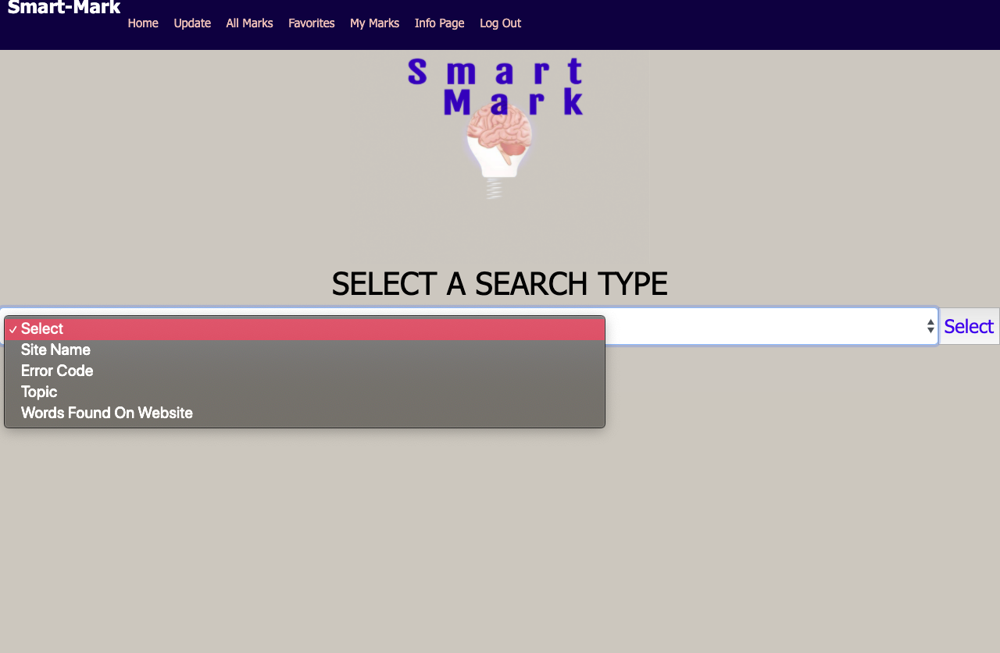

## Description
Smart-Mark,
- Two week sprint
-A FullStack bookmarking application where users are able to track programing errors they encounter and the resources found to resolve them
-a resouce can be tracked by lables that the user inputs or words found on the web page of the resource  
-lables include error code, url, site name, and topic
-Users can find resources by searching for any works found on bookmarked sites or labels attached to said resources
features include adding into the application,updating information found on the app, deleteing information, liking information, searching through the app, and favoriting information.
## Screen Shot
- users are able to select a search type and search through the application on this page

- this page shows all the resources stored in the application 

- this page only shows resources that the user has added into the application 

- this page shows resources that the the user has favorited

- this page allows the user to add resources into the database

- this page allows the user to update existing resources in the application 
## Prerequisites
-none
 
 
## Installation
* make a new datbase and name it prime_app
* Start postgres if not running already by using `brew services start postgresql`
* Run `npm install`
* Run `npm run server`
* Run `npm run client`
* Navigate to `localhost:3000`

 
 
## Built With
-React
 -Redux 
 -Node 
 -Sagas 
-Express 
 -Bootstraps 
 -sweetalert2 
 -Request 
 -keyword-extractor 
 -Passport 

